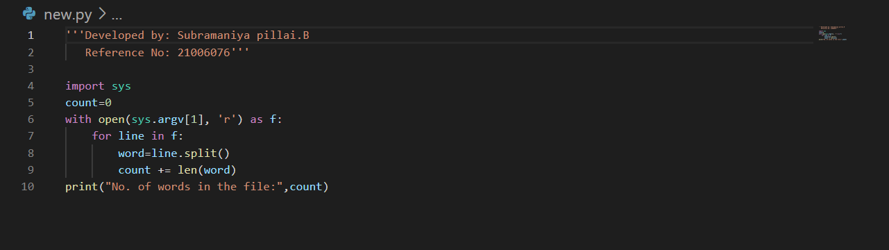
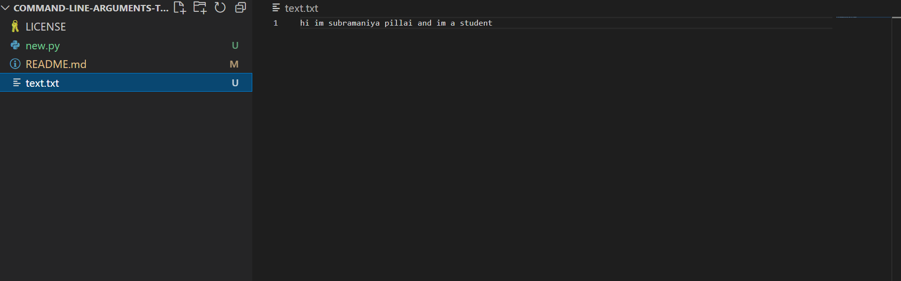
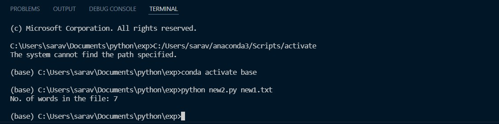

# command-line-arguments-to-count-word
## AIM:
To write a python program for getting the word count from the contents of a file using command line arguments.
## EQUIPEMENT'S REQUIRED: 
PC
Anaconda - Python 3.7
## ALGORITHM: 
### Step 1:
Create a txt file to count the number of word in that file.

### Step 2: 
 Open the txt file in read mode using open().
### Step 3: 
Using split() funtion to split the words in the txt file and count it.
### Step 4:  
Save the python program using .py extention.
### Step 5: 
Run the python program in terminal to get the output.
### Step 6: 
Number of words in the txt file is displayed as the output.
## PROGRAM:
```
import sys
count=0
with open(sys.argv[1], 'r') as f:
    for line in f:
        word=line.split()
        count += len(word)
print("No. of words in the file:",count)
```

### OUTPUT:
#### PROGRAM FILE:

#### text file:

#### terminal:



## RESULT:
Thus the program is written to find the word count from the contents of a file using command line arguments.
